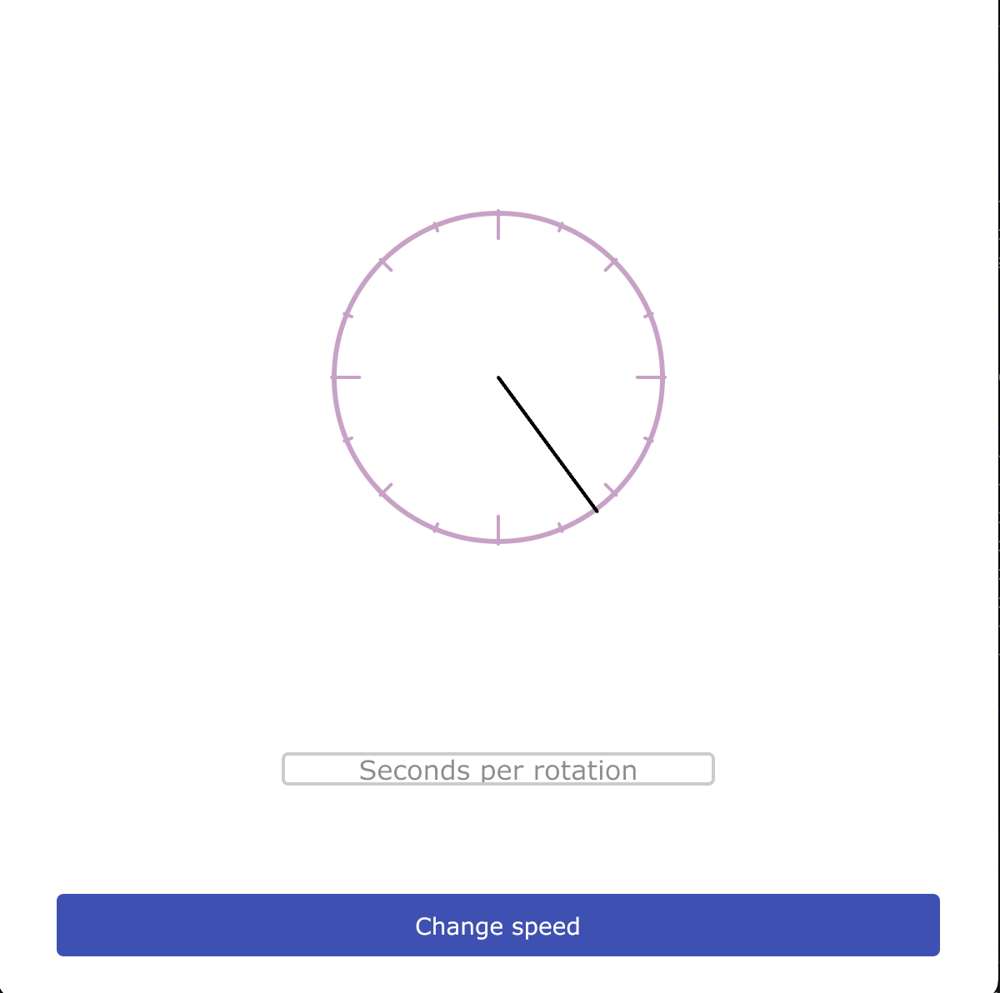

# Sound Position Timer
Graphic clock timer to measure the duration of sound positions within syllables. Measure sounds for 2 second, 1 second, 
and half second syllable durations. Frequently used by speech language pathologists to treat patients with a stutter. 
The hand rotates at a default 4 seconds per rotation but can be speed up or slowed down as needed. 

  <p align="center">
  
  </p>

## Setup 
 Download a [Golang](https://go.dev) version >= 1.23.2. Upon successful download verify versioning with
```bash
$ go version
```
Clone this repository
```bash
$ git clone https://github.com/IMSterling/soundPositionTimer.git
```
Build an executable
```bash
$ go build -o soundPositionTimer main.go
```
Run the built file
```bash
$ ./soundPositionTimer
``` 

[Optional] Add the executable to your system's PATH so you can run the executable from anywhere

## Implementation details

* This tool is build using [Gio](https://gioui.org/) and is designed to be platform agnostic. It runs on MacOSX, Linux, and Windows. 
* This implementation borrows heavily from [this](https://jonegil.github.io/gui-with-gio/egg_timer/) fantastic Gio tutorial 

## Contact 
* Got questions? Email me at ianmcdiarmidsterling at gmail dot com
